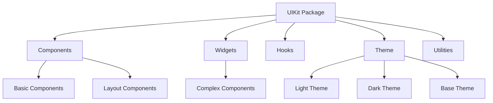
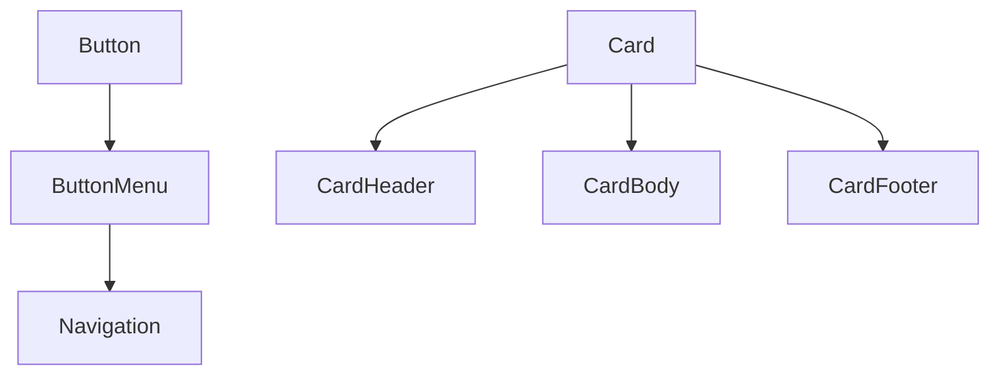

# System Patterns: Inukings UIKit

## Architecture Overview

The Inukings UIKit follows a component-based architecture organized into distinct categories, allowing for modular development and easy maintenance.

## Directory Structure

The codebase is organized as follows:

- **src/components/**: Basic UI components (Button, Card, Input, etc.)
- **src/widgets/**: More complex, composed components (Menu, Modal, etc.)
- **src/hooks/**: Custom React hooks
- **src/theme/**: Theming system and configuration
- **src/util/**: Utility functions
- **src/**tests**/**: Unit tests for components and widgets

## Key Design Patterns

### 1. Atomic Design Methodology

Components are organized following a loose interpretation of atomic design:

- **Atoms**: Basic building blocks (Text, Button, Input)
- **Molecules**: Combinations of atoms (Card, ButtonMenu)
- **Organisms**: More complex components (Menu, Modal)

### 2. Component Composition

Components are designed to be composable, with higher-level components built from simpler ones:

### 3. Prop-Based Configuration

Components use a consistent prop interface pattern:

- Standard HTML attributes pass through to underlying DOM elements
- Component-specific props for customization
- Variants and sizes controlled through enums

### 4. Styled-Components Pattern

Styling follows a consistent approach using styled-components:

- Base component styles defined in component files
- Theme-sensitive styles access theme context
- Component variants controlled through props
- Responsive behaviors managed through theme breakpoints

### 5. Type Definitions

TypeScript types are organized systematically:

- Each component has its own types.ts file
- Common types are extracted to reusable interfaces
- Prop interfaces extend standard HTML attribute interfaces where appropriate
- Strict typing for theme objects and variants

## Component Relationships

### Component Extensions

Many components extend foundation components:

- IconButton extends Button
- Many components build upon Flex for layout
- Text and Heading share common typography patterns

### Theme Integration

All components connect to the theme through:

- ThemeProvider context
- Accessing design tokens from the theme
- Responding to theme changes (dark/light mode)

### Responsive Patterns

Responsive behavior is handled through:

- Breakpoint-based styling
- useMatchBreakpoints hook for conditional rendering
- Mobile-first approach to CSS

## Testing Strategy

The UIKit employs a comprehensive testing approach:

- Jest for test running
- React Testing Library for component testing
- Component tests focus on:
  - Rendering with different props
  - User interactions
  - Accessibility concerns
  - Theme integration
